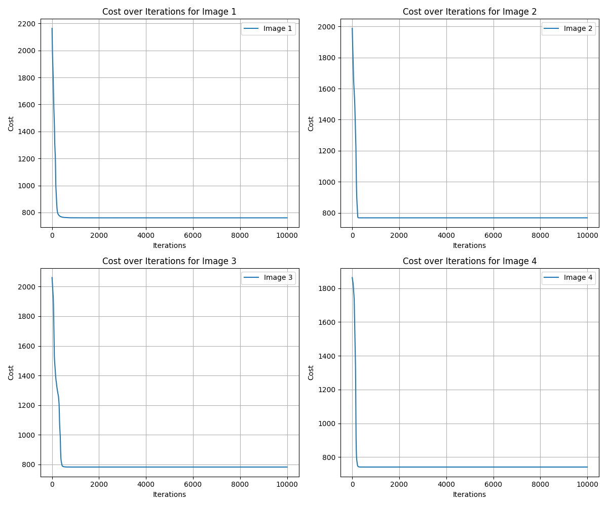
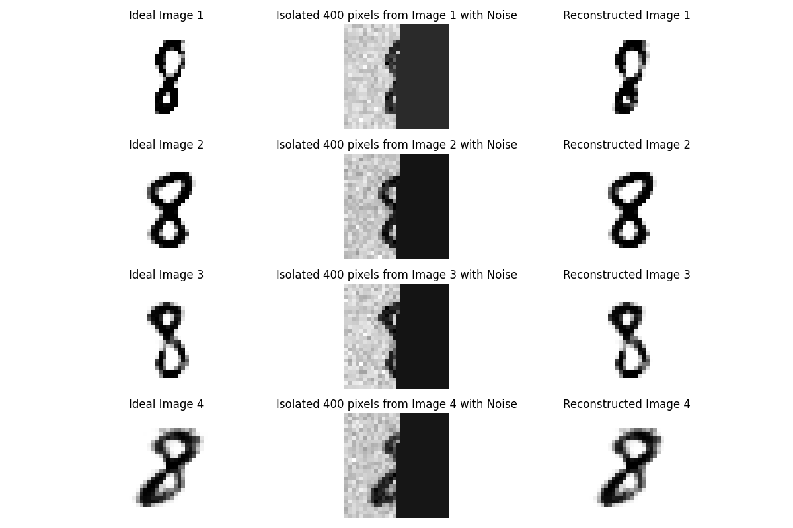

# Image Inpainting Using a Generative Model  

## Description  
This project implements an image inpainting technique using  generative model. The goal is to reconstruct a partially missing or noisy image of the handwritten numeral "8" using an optimization approach.  

We are provided with:
- A dataset (`data2.mat`) that includes noisy and incomplete images.
- A generative model (`data1.mat`) that captures the statistical properties of "8".

The objective is to estimate the best input **Z** to the generative model to reconstruct the missing pixels.  

## Dataset  
The file `data2.mat` contains:  
- `Xi` (784 × 4): Ideal images of the digit 8 (used only for comparison).  
- `Xn` (784 × 4): Noisy and incomplete images (our given data).  

### **Data Representation**  
Each image is a **784 × 1** vector, representing a **28 × 28** grayscale image. Only the first **N** elements of each column in `Xn` are useful, while the remaining pixels (**N+1 to 784**) are considered missing. The transformation follows:  

```math
X_n = T X_i + \text{noise}
```
Where
- **T** is a transformation matrix of size **N × 784**.
- **Xi** represents the ideal image.
- The **noise** is added with mean 0 and unknown variance.

## Approach
We solve this problem using **Gradient Descent (GD)** to estimate the optimal input **Z** such that the reconstructed image best matches the given data **Xn** in the observed region.

### Steps
1. Initialize **Z** (random normal distribution).
2. Forward pass through the generative model to generate an estimated image.
3. Compute the reconstruction loss using the available pixels (first **N** elements of **Xn**).
4. Optimize **Z** using **Gradient Descent** to minimize the loss.
5. Reconstruct the missing parts using the optimized **Z**.
6. Evaluate performance for different values of **N** (500, 400, 350, 300).

## Installation and Setup

### 1.Clone the repository:
```git clone https://github.com/orestis-koutroumpas/Inpainting.git```

### 2. Install dependencies:
```pip install numpy scipy matplotlib```

### 3. Run the script:
```python inpainting.py```

## Output
The script reconstructs the missing pixels and displays the results.

- Left: Ground truth image (for comparison).
- Middle: Given noisy and incomplete image.
- Right: Reconstructed image using the generative model.

### Plot of Cost Function vs. Iteration 

To analyze the performance of gradient descent, we plot the cost function per iteration:  

<p align="center"> 
   
</p>  

Each curve represents the learning process for a different image, showing how the reconstruction accuracy evolves over time.

### Example Output (N=400)

<p align="center"> 
 
</p>

## Results  

We test different values of **N** to determine when reconstruction fails:  

        | **N**   | **Reconstruction Quality** |
        |---------|----------------------------|
        | **500** |   Perfect reconstruction   |
        | **400** |     High reconstruction    |
        | **350** |      Some degradation      |
        | **300** |   Noticeable degradation   |
        | **250** |     Poor reconstruction    |